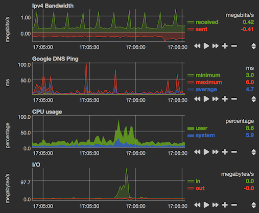

# Übersicht-Netdata
This widget allows you to view [Netdata](https://my-netdata.io/) graphs directly from your desktop with [Übersicht](http://tracesof.net/uebersicht/).

`v1.0.0`

Features out of the box:
- IPV4 Bandwidth graph
- CPU usage graph
- I/O graph
- Ping time graph (with additional install of fping plugin)

Additional Features with configuration:
- Any data accessible from [http://localhost:19999/dashboard.js](http://localhost:19999/dashboard.js)
- Any of the other graph styles provided by Netdata

## Install

1. With homebrew, install netdata: `brew install netdata`
2. Download and move `netdata.widget` plugin to Übersicht widget folder

Optional:

3. With homebrew install fping: `brew install fping`
4. Edit `fping.conf` with `nano /usr/local/etc/netdata/fping.conf` to indicate what hosts to ping (8.8.8.8 is google DNS)

----

